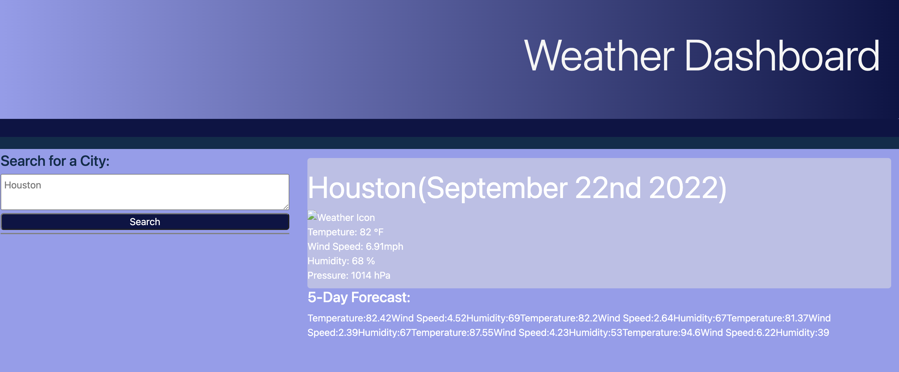
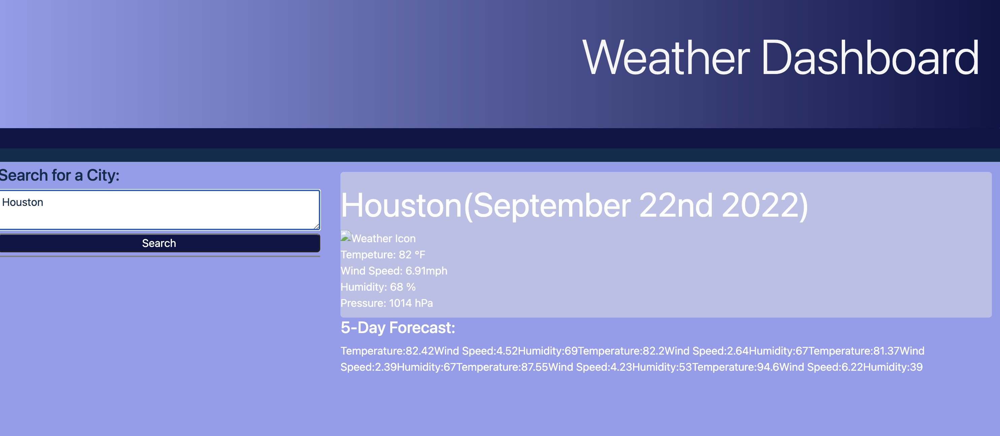
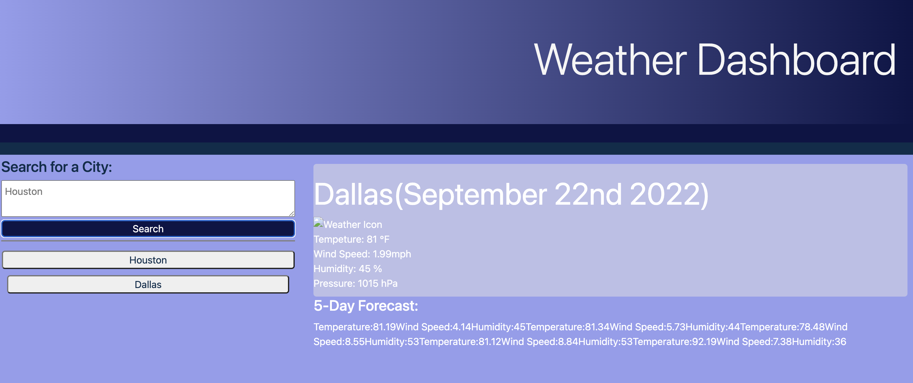
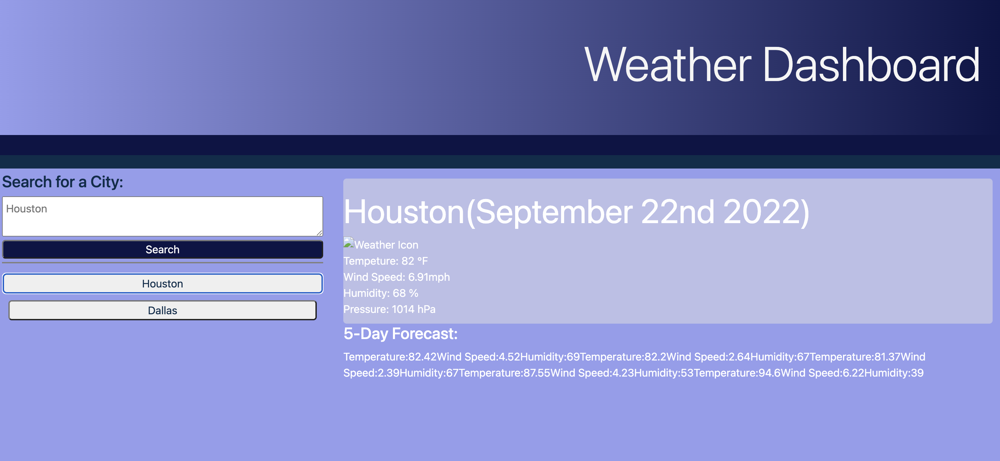

## take-a-jacket

## Description
<a href="https://emsaw721.github.io/take-a-jacket/"> Weather Dashboard </a> is an application that allows the user to look up the weather in any city using third party api's. 

## Usage
Weather Dashboard consists of a search box where the user can look up any city in the world and find weather data displayed. 

At first, the application user will see the opening page. 

Then, the user will click in the text box and enter the city for which they would like to retrieve the data. 

The user will see current city data as well as a five-day-forecast displayed. The user will also see the city they just searched in a gray box below, indicating it is an already searched item. 

The user can retrieve any past data and have it displayed by clicking on the gray button with the past cities name displayed. 

## Roadmap

Future iterations of this app will have stylized cards displaying the five-day forecast items and will have an icon that shows the current weather. 

## Authors and acknowledgment
This README was made possible by https://www.makeareadme.com/. 

## License
[MIT](https://choosealicense.com/licenses/mit/)

